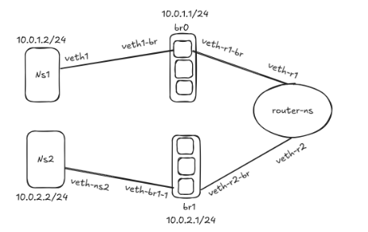

# FIB (Forward Information Base)

#How FIB network architecture generally works:

1.The Forwarding Information Base (FIB) is a table used by routers to determine packet forwarding.

2.It contains mappings of destination network addresses to the next-hop router or interface.

#Populating the FIB:

1.FIB entries are populated through routing protocols such as OSPF, RIP, and BGP.

2.These protocols exchange routing information among routers to build and update the FIB.

#Forwarding Decisions:

1.When a router receives an incoming packet, it examines the destination IP address.

2.The router looks up the destination address in its FIB.

3.If a matching entry is found in the FIB, the router forwards the packet based on the next-hop information specified in the FIB entry.

4.If no matching entry is found, the router typically either drops the packet or forwards it to a default route if configured.

#Proposed network topology:



How the FIB works in our environment:
1. Router Configuration:
   
In our setup, the router namespace is acting as a router between the red and blue namespaces.
The router's FIB contains information about the next-hop IP addresses for each destination network.
When a packet arrives at the router, it consults its FIB to determine the next-hop interface and IP address for the packet.

2.Routing Table:

The routing table in the router namespace contains the routing information used to populate the FIB.
Entries in the routing table specify the destination network (e.g., 10.11.0.0/24 for the red namespace and 10.12.0.0/24 for the blue namespace) and the next-hop IP address for each network.
The router uses this routing table to populate its FIB with the necessary forwarding information.

Mac Address table:
Routing table:
Packet Forwarding:

When a packet arrives at the router, it performs a lookup in its FIB to determine the next-hop interface and IP address for the packet's destination.
Based on the information in the FIB, the router forwards the packet to the appropriate interface.
If the packet's destination is within the same network (e.g., from red to router), the router forwards the packet directly to the destination host without further routing.

#Connectivity:

#Create namespaces
```
kakon@DevOps:~$ sudo ip netns add node1
kakon@DevOps:~$ sudo ip netns add node2
kakon@DevOps:~$ sudo ip netns add Router
```
Create bridge
```
kakon@DevOps:~$ sudo ip link add br0 type bridge
kakon@DevOps:~$ sudo ip link add br1 type bridge
```
#Bridge up
```
kakon@DevOps:~$ sudo ip link set br0 up
kakon@DevOps:~$ sudo ip link set br1 up
```
#Assign ip address in bridge
```
kakon@DevOps:~$ sudo ip addr add 10.11.0.0/24 dev br0
kakon@DevOps:~$ sudo ip addr add 10.12.0.0/24 dev br1
```
#Delete ip address in bridge
```
kakon@DevOps:~$ sudo ip addr add 10.11.0.0/24 dev br0
```
#Delete ip address in namespace cable
```
kakon@DevOps:~$ sudo ip addr add 10.11.0.0/24 via red-veth
```
#Delete veth link 
```
kakon@DevOps:~$ sudo ip link delete veth-host
```
