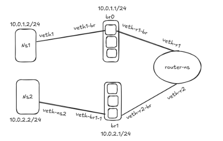

# Linux Network Namespace Simulation Assignment

#Network namespaces in Linux allow for the creation of isolated network environments within a single host. This assignment will help you understand how to create and manage multiple network namespaces and connect them using bridges and routing.

#Required Components

•⁠ Network Bridges
•⁠ ⁠Bridge 0 (br0) 
•⁠ ⁠Bridge 1 (br1)

#Network Namespaces

•⁠ ⁠Namespace 1 (ns1) - connected to br0
•⁠ ⁠Namespace 2 (ns2) - connected to br1 
•⁠ ⁠Router namespace (router-ns) - connects both bridges

#Required Tasks:

1.⁠ ⁠Create Network Bridges
   Set up br0 and br1

#Ensure bridges are properly configured and active

2.⁠ ⁠Create Network Namespaces
   Create three separate network namespaces (ns1, ns2, router-ns)

#Verify namespace creation

3.⁠ ⁠Create Virtual Interfaces and Connections
   Create appropriate virtual ethernet (veth) pairs
   Connect interfaces to correct namespaces
   Connect interfaces to appropriate bridges

4.⁠ ⁠Configure IP Addresses
   Assign appropriate IP addresses to all interfaces
   Ensure proper subnet configuration
   Document your IP addressing scheme

5.⁠ ⁠Set Up Routing
   Configure routing between namespaces
   Enable IP forwarding where necessary
   Establish default routes

6.⁠ ⁠Enable and Test Connectivity
   Ensure ping works between ns1 and ns2
   Document and test all network paths
   Verify full connectivity

#Create a network simulation with two separate networks connected via a router using Linux network namespaces and bridges.



# Create network bridges
```
kakon@DevOps:~$  sudo ip link add name br0 type bridge
kakon@DevOps:~$  sudo ip link add name br1 type bridge
```
# Bring bridges up
```
kakon@DevOps:~$  ip link set br0 up
kakon@DevOps:~$  ip link set br1 up
```
#Create Network Namespaces
```
kakon@DevOps:~$  sudo ip netns add ns1
kakon@DevOps:~$  sudo ip netns add ns2
kakon@DevOps:~$  sudo ip netns add router-ns
kakon@DevOps:~$  sudo ip netns list
```
#Create veth Pairs and Connect

# ns1 ↔ br0
```
kakon@DevOps:~$  sudo ip link add veth1 type veth peer name veth1-br
kakon@DevOps:~$  sudo ip link set veth1 netns ns1
kakon@DevOps:~$  sudo ip link set veth1-br master br0
kakon@DevOps:~$  sudo ip link set veth1-br up
```

# router-ns ↔ br0
```
kakon@DevOps:~$  sudo ip link add veth-r1 type veth peer name veth-r1-br
kakon@DevOps:~$  sudo ip link set veth-r1 netns router-ns
kakon@DevOps:~$  sudo ip link set veth-r1-br master br0
kakon@DevOps:~$  sudo ip link set veth-r1-br up
```
# router-ns ↔ br1
```
kakon@DevOps:~$  sudoip link add veth-r2 type veth peer name veth-r2-br
kakon@DevOps:~$  sudo ip link set veth-r2 netns router-ns
kakon@DevOps:~$  sudo ip link set veth-r2-br master br1
kakon@DevOps:~$  sudo ip link set veth-r2-br up
```
# ns2 ↔ br1
```
kakon@DevOps:~$  sudo ip link add veth2 type veth peer name veth2-br
kakon@DevOps:~$  sudo ip link set veth2 netns ns2
kakon@DevOps:~$  sudo ip link set veth2-br master br1
kakon@DevOps:~$  sudo ip link set veth2-br up
```

#Assign IP Addresses

# ns1
```
kakon@DevOps:~$  sudo ip netns exec ns1 ip addr add 10.0.1.2/24 dev veth1
kakon@DevOps:~$  sudo ip netns exec ns1 ip link set veth1 up
kakon@DevOps:~$  sudo ip netns exec ns1 ip route add default via 10.0.1.1
```
# ns2
```
kakon@DevOps:~$  sudo ip netns exec ns2 ip addr add 10.0.2.2/24 dev veth2
kakon@DevOps:~$  sudo ip netns exec ns2 ip link set veth2 up
kakon@DevOps:~$  sudo ip netns exec ns2 ip route add default via 10.0.2.1
```
# router-ns
```
kakon@DevOps:~$  sudo ip netns exec router-ns ip addr add 10.0.1.1/24 dev veth-r1
kakon@DevOps:~$  sudo ip netns exec router-ns ip addr add 10.0.2.1/24 dev veth-r2
kakon@DevOps:~$  sudo ip netns exec router-ns ip link set veth-r1 up
kakon@DevOps:~$  sudo ip netns exec router-ns ip link set veth-r2 up
kakon@DevOps:~$  sudo ip netns exec router-ns ip link set lo up
```

#Set Up Routing

# Enable IP forwarding in router-ns
```
kakon@DevOps:~$  sudo ip netns exec router-ns sysctl -w net.ipv4.ip_forward=1
```

#Test & Verify Connectivity
```
Ping from ns1 to ns2:
kakon@DevOps:~$  sudo ip netns exec ns1 ping -c 4 10.0.2.2
```

#Tracepath / Traceroute:
```
kakon@DevOps:~$  sudo ip netns exec ns1 traceroute 10.0.2.2
```
#Confirm Namespaces and Interfaces:
```
kakon@DevOps:~$  sudo ip netns exec ns1 ip a
kakon@DevOps:~$  sudo ip netns exec router-ns ip r
kakon@DevOps:~$  sudo ip netns exec ns2 ip a
```

Implement your solution using either: 

•⁠ ⁠A bash script for automation 
```
setup.sh
#!/bin/bash

set -e
echo "🔧 Setting up network lab"

# Create bridges
ip link add name br0 type bridge
ip link add name br1 type bridge
ip link set br0 up
ip link set br1 up

# Create namespaces
for ns in ns1 ns2 router-ns; do
    ip netns add $ns
done

# Create veth pairs and assign
ip link add veth1 type veth peer name veth1-br
ip link set veth1 netns ns1
ip link set veth1-br master br0
ip link set veth1-br up

ip link add veth-r1 type veth peer name veth-r1-br
ip link set veth-r1 netns router-ns
ip link set veth-r1-br master br0
ip link set veth-r1-br up

ip link add veth-r2 type veth peer name veth-r2-br
ip link set veth-r2 netns router-ns
ip link set veth-r2-br master br1
ip link set veth-r2-br up

ip link add veth2 type veth peer name veth2-br
ip link set veth2 netns ns2
ip link set veth2-br master br1
ip link set veth2-br up

# Configure interfaces & IPs
ip netns exec ns1 ip addr add 10.0.1.2/24 dev veth1
ip netns exec ns1 ip link set veth1 up
ip netns exec ns1 ip route add default via 10.0.1.1

ip netns exec ns2 ip addr add 10.0.2.2/24 dev veth2
ip netns exec ns2 ip link set veth2 up
ip netns exec ns2 ip route add default via 10.0.2.1

ip netns exec router-ns ip addr add 10.0.1.1/24 dev veth-r1
ip netns exec router-ns ip addr add 10.0.2.1/24 dev veth-r2
ip netns exec router-ns ip link set veth-r1 up
ip netns exec router-ns ip link set veth-r2 up
ip netns exec router-ns ip link set lo up
ip netns exec router-ns sysctl -w net.ipv4.ip_forward=1

echo "Setup complete!"
```

•⁠ ⁠A Makefile for automated setup and teardown
```
.PHONY: setup teardown

setup:
	@echo "Setting up network..."
	@bash setup.sh

teardown:
	@echo "Cleaning up..."
	@ip netns del ns1 || true
	@ip netns del ns2 || true
	@ip netns del router-ns || true
	@ip link del br0 || true
	@ip link del br1 || true
	@echo "Teardown complete."

```
